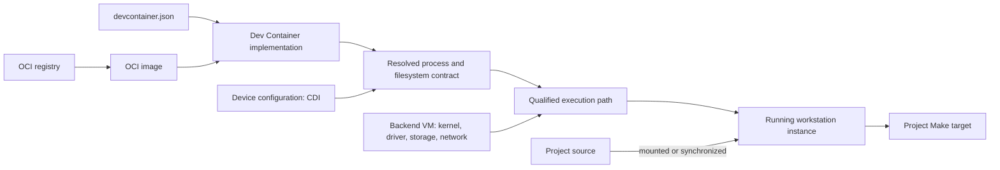
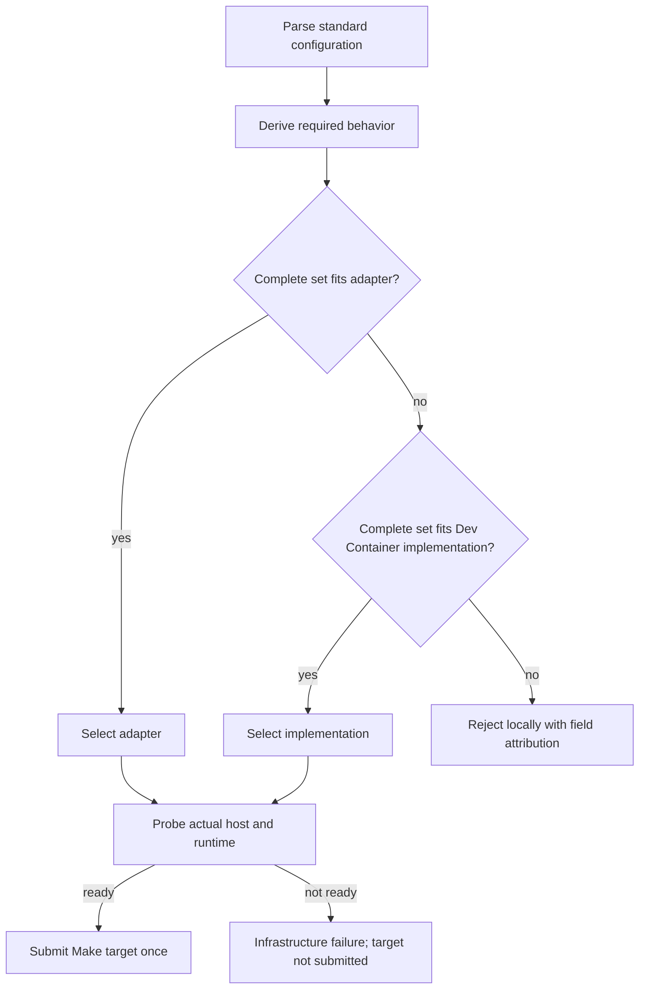

# Dev Container execution landscape

## Why application bundles exist

Moving an executable to another machine sounds simple until it actually has to
run. The program may depend on a particular Linux distribution, shared
libraries, language runtime, command-line tools, configuration files, users,
filesystem layout, CPU architecture, kernel facilities, or accelerator driver.
Copying only the executable usually leaves an implicit list of assumptions
behind. Reinstalling those dependencies by hand makes every new machine a
snowflake.

An application bundle tries to make the application-controlled environment
explicit and transportable:

```text
application
  + tools and shared libraries
  + filesystem layout and defaults
  + content identity
  = a bundle another machine can obtain and prepare reproducibly
```

The Open Container Initiative (OCI) addresses this problem by separating three
contracts. The image format packages a content-addressed filesystem and its
defaults. The distribution protocol moves that content through registries. The
runtime specification describes how a materialized filesystem becomes a
process using the host kernel. This separation lets many builders, registries,
engines, and runtimes exchange the same application bundle without requiring
one vendor's end-to-end stack.

In short, OCI answers: **how can this application environment be packaged,
identified, transported, and started on another compatible machine?**

But an application bundle is not yet a development workstation. A developer
also needs source placement, build-time customization, tool Features, user
identity, lifecycle setup, ports, and a rule for reusing the prepared
environment. The Dev Container specification adds that workstation-level
configuration above OCI. It can point to an existing image, build a new one, or
coordinate several services, then prescribe the steps that turn those bytes
into a usable development environment.

Dev Containers answer the next question: **how should a developer work inside
that environment?**

Cloudmake accepts that Dev Container configuration as a portable statement of a
developer workstation and keeps the project Make target as the execution
surface. Turning the configuration into a running process is still not one
operation. It crosses an image registry, an image format, a builder or Feature
installer, a container engine, a host kernel, optional device integration, and
provider lifecycle rules.

This document explains that landscape for a developer who knows Docker or
Codespaces but does not want to become a container-runtime specialist. It is a
tutorial and implementation survey, not the Cloudmake product contract. The
normative behavior is in the [Cloudmake 2.4 Dev Container contract](devcontainer-v2.4-contract.md)
and the exact accepted fields are in [Portable Dev Container workstations](devcontainers.md).

## The one-minute model

Remember five layers:

1. A Dev Container configuration describes the desired development experience.
2. An OCI image supplies a portable filesystem plus process defaults.
3. A Dev Container implementation adds builds, Features, users, lifecycle
   commands, workspace placement, and ports.
4. A qualified execution path starts the process through the host kernel.
5. The backend VM and provider decide which kernel, privilege, storage,
   networking, and devices actually exist.



No one layer proves the next one will work. A valid Dev Container file does not
guarantee that a provider implements every field. A valid OCI image does not
guarantee the selected host architecture or GPU driver. An installed `docker`,
`crun`, or `proot` command does not prove that it can create the required
process on the current VM.

The rest of this tutorial follows those layers in order: what each standard
defines, how the execution paths differ, which state may be reused, and how
Cloudmake accepts or rejects a path before running Make.

## A small vocabulary

| Term | Meaning here |
| --- | --- |
| **Dev Container configuration** | Standard metadata in `devcontainer.json` describing how a development environment should be created and configured. |
| **Dev Container implementation** | A tool or service that consumes that configuration, such as the reference Dev Container CLI or GitHub Codespaces. |
| **OCI image** | A manifest, configuration, and content-addressed filesystem layers, possibly selected from a multi-platform image index. |
| **Registry** | A service exposing the OCI Distribution protocol for discovering and transferring image manifests and blobs. |
| **Container engine** | A higher-level tool such as Docker or Podman that pulls images, prepares storage and networking, generates a runtime specification, and invokes lower layers. |
| **Low-level OCI runtime** | A program such as `runc` or `crun` that creates a container from a prepared root filesystem and `config.json`. It does not pull images or implement Dev Container behavior. |
| **Portable adapter** | Cloudmake's bounded cross-backend path. It realizes only documented behavior through a provider, engine, low-level runtime, or userspace tool. |
| **Workstation instance** | The prepared environment reused by later project targets while its identity and configuration remain valid. |
| **Workspace** | The mutable project tree and generated files. It is separate from the immutable tool image. |
| **Qualified** | Tested and declared capable of preserving named behavior. The actual VM is still checked before use. |

The Dev Container project itself describes `devcontainer.json` as instructions
for supporting tools and services to access or create a well-defined tool and
runtime stack. It also lists product-specific differences, so “standard input”
does not mean “identical implementation everywhere.” See the official
[supporting tools and services](https://containers.dev/supporting) and
[metadata reference](https://containers.dev/implementors/json_reference/).

## The standards are complementary

### Dev Container: development behavior

The Dev Container specification covers more than choosing an image. It can
describe a Dockerfile build, Compose services, Features, environment variables,
users, mounts, ports, host requirements, and commands at several lifecycle
phases. The reference CLI can construct and configure an environment from this
metadata; its lifecycle behavior is materially richer than `docker run`.

The official guide shows three distinct environment sources—an image, a
Dockerfile, or Docker Compose—and explains that Features and lifecycle scripts
are additional Dev Container operations. See
[Using Images, Dockerfiles, and Docker Compose](https://containers.dev/guide/dockerfile)
and the [Dev Container CLI](https://github.com/devcontainers/cli).

### OCI image and distribution: packaged bytes

The OCI Image Specification defines manifests, optional image indexes,
filesystem layers, and image configuration. A digest names content rather than
a mutable registry tag. The OCI Distribution Specification defines the
registry protocol used to discover and transfer that content.

An image does not describe the complete development lifecycle, provider
machine, or live process isolation. The OCI specifications explicitly separate
the [image format](https://github.com/opencontainers/image-spec/blob/main/spec.md),
[distribution protocol](https://github.com/opencontainers/distribution-spec/blob/main/spec.md),
and [runtime behavior](https://github.com/opencontainers/runtime-spec).

### OCI runtime: a prepared process contract

The OCI Runtime Specification consumes a *runtime bundle*: a materialized root
filesystem plus `config.json`. That file contains the process, environment,
mounts, namespaces, capabilities, resource controls, and other platform-specific
execution data. A low-level runtime does not pull an image, apply Dev Container
Features, run lifecycle commands, or decide where the project should live. See
the official
[runtime configuration](https://github.com/opencontainers/runtime-spec/blob/main/config.md).

This distinction explains a common surprise: finding `crun` or `runc` on a VM
does not make that VM a Docker replacement. Something must still fetch and
verify the image, unpack its layers, generate a valid bundle, arrange writable
storage and mounts, and translate the desired workstation behavior.

### CDI: device-specific edits

GPU access is not merely “mount `/dev/nvidia0`.” A device can require several
nodes, host libraries, environment values, hooks, or other edits. CDI lets a
vendor describe those edits and lets a runtime apply them when a fully
qualified device name is requested. CDI deliberately leaves scheduling and
resource allocation to another layer. See the
[Container Device Interface specification](https://github.com/cncf-tags/container-device-interface/blob/main/SPEC.md).

Dev Container `hostRequirements.gpu` says that the host should have a GPU; it
does not select a particular device through CDI. Cloudmake's
`customizations.cloudmake.devices` extension supplies that explicit CDI
selection. The backend still has to allocate suitable hardware and prove that
the runtime, host driver, CDI metadata, and image are compatible.

## The execution continuum

There is no single best execution path. More capable mechanisms preserve more
of the standard, while more restricted mechanisms work on more managed
platforms.

| Execution path | Who prepares the workstation | Strength | Typical limitation |
| --- | --- | --- | --- |
| Provider-native Dev Container | Cloud service, such as Codespaces | Deep provider integration, durable workstation identity, ports and lifecycle managed by the service | Provider-specific field behavior and policy; one cannot assume every standard field is identical elsewhere |
| Reference Dev Container CLI over Docker | Reference CLI plus Docker daemon | Broad standard coverage, including builds, Features, users, and lifecycle commands | Requires a working Docker service and enough host authority; Docker's boundary is not Cloudmake's restricted sandbox |
| High-level OCI engine | Docker, Podman, or nerdctl/containerd | Mature pulling, unpacking, storage, namespaces, and process execution | A plain image launch does not implement rich Dev Container lifecycle semantics |
| Low-level OCI runtime | Cloudmake's portable adapter prepares a bundle for `crun` | Useful on a managed VM where the qualified kernel operations work but no daemon is available | Backend owns image materialization and exact runtime-profile qualification |
| Userspace tool | Cloudmake's portable adapter materializes an image and executes through PRoot plus privilege reduction | Can work without a daemon, privileged mount, or user namespace | Weaker isolation, lower performance, incomplete OCI semantics, and no automatic acceptance of rich Dev Container behavior |

For a selected Dev Container configuration, Cloudmake uses one of two paths.
The *portable adapter* accepts the bounded cross-backend profile and uses one
qualified mechanism from the table. A *Dev Container implementation* consumes
richer standard behavior; the current reference-CLI path is recorded as
`devcontainer-native`. Codespaces realizes the portable profile through its
provider-managed environment, recorded as `provider-native`. These names
identify execution paths; every path may still consume an OCI image.

PRoot deserves special precision. It redirects filesystem-related system calls
in userspace; it is not an OCI runtime. The PRoot mechanism in Cloudmake's
portable adapter therefore consumes only selected OCI image/runtime behavior.
It must never be presented as implementing the entire OCI Runtime
Specification.

## Configuration, image, instance, and workspace are different state

Four identities evolve on different schedules:

| State | Example identity | What invalidates it |
| --- | --- | --- |
| Configuration | Hash of `devcontainer.json` and relevant local build input | Configuration or build-input change |
| Image | Registry digest or derived image ID | Explicit rebuild or a new tag resolution |
| Workstation instance | Codespace, container ID, or backend preparation receipt | Resource replacement, failed ownership proof, or incompatible preparation identity |
| Workspace | Project source fingerprint plus generated files | Source reconciliation, project build rules, or resource/checkpoint loss |

A tag such as `ubuntu:24.04` is a convenient source reference, not an immutable
execution identity. A capable implementation resolves it and records the
actual digest used by the workstation. A digest-pinned image avoids tag drift,
but it still does not prove platform, driver, or host compatibility.

Persistence is only an optimization:

- a stopped Codespace or GCP disk can preserve the workstation and workspace;
- a Colab replacement VM requires image/tool preparation again unless selected
  state is restored from a checkpoint;
- an OCI layer cache can avoid downloading unchanged blobs without preserving
  project output; and
- a workspace checkpoint can preserve output without making the old kernel,
  driver, or container process reusable.

Source, the Dev Container configuration, and project Make targets remain the
rebuild authority. A cache, stopped VM, image materialization, or checkpoint
may disappear.

## Lifecycle is observable behavior

Lifecycle fields are not comments. Their ordering and frequency matter:

```text
resolve/build image
  -> create workstation
  -> run create-phase commands once
  -> run start-phase commands for this start
  -> execute requested Make target at most once
```

If an adapter creates a fresh read-only image process for every Make target, it
cannot honestly claim persistent `postCreateCommand` semantics merely because
the project directory survives. Similarly, ignoring `remoteUser`, a mount, or
`overrideCommand` may change permissions or the process being tested.

Cloudmake consequently turns meaningful fields into required behavior. One
execution path must satisfy the complete set. It does not combine “image tag
from the Dev Container implementation” with “port forwarding from the
adapter,” because that would not identify one coherent workstation lifecycle.

## Capability negotiation

The important question is not “does this VM have Docker?” It is “can one
qualified execution path preserve everything this configuration asks for?”



Examples of the normalized vocabulary include:

| Standard behavior | Cloudmake capability name |
| --- | --- |
| Digest or tagged image | `image-digest`, `image-tag` |
| Dockerfile/build source | `image-build` |
| Features | `features` |
| `onCreateCommand`, `updateContentCommand`, `postCreateCommand` | `lifecycle-create` |
| Container/remote user settings | `user-selection` |
| `forwardPorts` | `forward-ports` |
| `hostRequirements` | `host-requirements` |
| CDI-qualified device selection | `cdi` |
| Added capabilities or privileged execution | `privilege` |

An error such as

```text
backend 'colab-notebook' cannot honor Dev Container requirement(s):
image-tag (image), lifecycle-create (postCreateCommand)
```

means the input is valid standard metadata, but the chosen backend has no
single qualified path for that behavior. It does not mean the Make target
failed.

## Static capability and dynamic proof

Backend declarations are ceilings, not promises about a replacement VM.

Static qualification answers:

- Does the backend have an implementation for this behavior?
- Can its transport support a bounded port path?
- Does it have a documented OCI/CDI execution route?
- Does its lifecycle permit workstation reuse?

Dynamic preflight answers:

- Is a declared engine installed and actually ready?
- Does the current host have enough CPU, memory, and storage?
- Is the requested architecture present in the image index?
- Is the GPU visible, is its driver usable, and can CDI resolve the requested
  name?
- Can the image be pulled with the runtime's existing identity?
- Can the requested mount/isolation operations execute under this VM's policy?

An installed executable is only a candidate. Docker can be present while its
daemon is unavailable; a low-level runtime can exist while cgroups or mounts
are forbidden; a GPU node can exist while the image's userspace libraries are
incompatible with the host driver.

## Least privilege is a portability strategy

Least privilege is not only a security preference. It defines a useful common
execution subset across managed clouds:

- immutable or read-only tool image;
- writable project workspace and temporary directory;
- no added Linux capabilities;
- `no-new-privileges`;
- no arbitrary host mounts;
- no assumption of a container daemon or privileged namespace creation; and
- explicit device access rather than blanket host exposure.

This profile fits more managed VM policies and reduces both provider and user
risk. A project that genuinely needs privilege can still express that standard
requirement, but Cloudmake rejects it on backends that have not qualified such
authority. It never silently converts a privileged workstation into a weaker
one and calls the result compatible.

Provider-native and Docker-backed implementations remain trust boundaries. A
trusted image can contain startup metadata and executable lifecycle content.
Least-privilege validation does not make an untrusted image safe to execute.

## What the current backends teach us

| Backend | Qualified execution lesson |
| --- | --- |
| Local | The reference Dev Container CLI over Docker is the richer baseline. A digest-only configuration can also use the portable adapter. |
| Codespaces | The provider itself owns the Dev Container workstation. Reusing that one active environment is preferable to nesting another container. |
| Host SSH | Runtime choice must be probed dynamically: Docker, Podman, nerdctl, or PRoot may be the first usable option for the portable adapter. |
| Colab notebook | A managed ephemeral VM can support a narrow `crun` adapter after bundle preparation, but not an assumed Docker daemon or the full Dev Container lifecycle. |
| GCP Compute SSH | A conventional persistent VM resembles the host-SSH model, but billing, lifecycle, network policy, accelerator attachment, and disk type belong to the provider backend. |
| Lightning Studio SSH | The common SSH adapter can be implemented, but product support still requires retained live qualification. |
| Kaggle notebook | A fresh job per target and expensive materialization make it a poor remote workstation even when the portable adapter can technically run. Execution possibility is not usability. |

These outcomes are why Cloudmake keeps product status separate from capability.
`Implemented`, `qualified`, `supported`, and `pleasant to use` are separate
claims.

## Diagnosing failures by layer

| Symptom | Likely layer | Cloudmake classification |
| --- | --- | --- |
| Unknown or unsupported `devcontainer.json` field | Configuration analysis | Compatibility failure before provider contact |
| Tag cannot resolve or registry denies pull | Distribution/image preparation | Infrastructure or credential-helper failure; target not submitted |
| No matching `linux/amd64` or `linux/arm64` manifest | Image/platform | Compatibility failure before target |
| Executable exists but runtime probe fails | Engine/runtime/host policy | Infrastructure failure; another declared mechanism may be probed before submission |
| Dynamic linker or shared library missing | Image closure or host-library injection | Image/runtime preparation failure, not a Make failure |
| CDI name absent or driver unusable | Device/runtime/host | Device preflight failure before target |
| Lifecycle command fails | Workstation preparation | Preparation failure; target not submitted |
| Make prints an error and returns nonzero | Project | Target failure; full Make output and provenance retained |
| Connection disappears after submission marker | Transport/provider | Ambiguous execution; never replay target automatically |

This layering avoids the unhelpful conclusion “containers do not work.” It
identifies whether the configuration, packaged tool closure, materializer,
runtime, driver, provider, transport, or project actually failed.

## Choosing a project configuration

Prefer the smallest configuration that states the behavior the project really
needs.

Use a digest-pinned image when:

- tools can be prebuilt into one image;
- the project needs the broadest managed-cloud portability; and
- Make can perform project-specific bootstrap and execution.

Use a tagged image or Dockerfile/Features when:

- local Docker or a provider-native Dev Container service is the intended
  workstation;
- standard lifecycle and user behavior are important; and
- reduced portability to restricted notebooks is acceptable.

Use Compose only when the development task genuinely requires multiple
services. It is not a harmless alternate spelling for one tool image and is not
currently qualified by Cloudmake.

Request CDI devices only when the project target needs accelerator access. A
GPU host requirement without an explicit device contract is insufficient for
reproducible execution, while a device contract cannot allocate hardware the
backend does not have.

## What Cloudmake normalizes

Cloudmake does not attempt to replace the Dev Container ecosystem. It provides
a Make-oriented remote-workstation layer above it:

- use the standard project configuration rather than a provider-specific
  notebook or Makefile;
- preserve direct native Make as the default unless the user opts in;
- analyze requested behavior before allocating or contacting a provider;
- select one backend-qualified execution path;
- dynamically prove the actual runtime, host, and device prerequisites;
- synchronize the authoritative source tree without requiring a Git clone on
  the VM;
- reuse or reconstruct a workstation according to backend lifecycle;
- execute the exact project Make target at most once; and
- record the chosen engine, immutable image identity, preparation, submission,
  and capability evidence in provenance.

The ordinary surface remains:

```sh
cloudmake --use BACKEND --devcontainer
cloudmake TARGET [NAME=value ...]
```

Backend allocation, image materialization, lifecycle receipts, and persistence
remain hidden unless they fail or the user asks for status. `--status` and
`--stop` remain available even if a saved Dev Container later becomes
incompatible, so a validation change cannot strand a billable resource.

## What Cloudmake does not normalize

- It does not promise that every standard field works on every backend.
- It does not turn PRoot into a conformant OCI runtime.
- It does not translate a CPU image into a GPU-compatible image.
- It does not install or repair host kernel drivers.
- It does not make provider network, quota, billing, or retention policies
  identical.
- It does not combine partial execution paths into a synthetic workstation.
- It does not take custody of registry or provider credentials.
- It does not make checkpoints authoritative or replay an ambiguous target.
- It does not treat editor interaction as the primary workflow; the project
  Make target remains the automation boundary.

The intended outcome is narrower and more useful: the same declared
development workstation and automated Make targets can run across the widest
set of qualified single-node resources without silently changing their
meaning.
