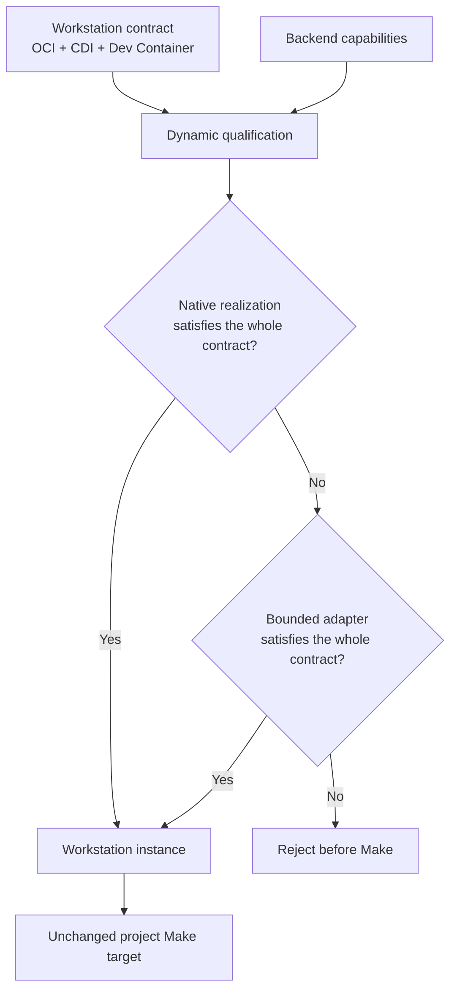

# Carrying one development workstation across unequal machines

Day 3 of the [Remote workstation tutorials](../README.md). This tutorial can be
read independently.

## From dependency hell to a workstation contract

You clone a project that worked perfectly six months ago. The README promises
three setup commands. One pinned package has disappeared; replacing it breaks a
library farther down the dependency tree; the native extension then loads the
wrong shared object; and after fixing `PATH`, the GPU framework reports that its
CUDA stack does not match the driver. Eventually the new project runs—but an
older project no longer does. A teammate offers the classic diagnosis: “It
works on my machine.”

That is **dependency hell**. The industry answer is an **application closure**:
not only the application executable, but every dependency it needs—libraries,
runtimes, tools, configuration, and filesystem content—plus every dependency
of those dependencies, recursively.

The [Open Container Initiative (OCI)](https://opencontainers.org/) gives that
closure a portable form:

- the image specification describes its filesystem and process defaults;
- the distribution specification lets registries store and deliver it; and
- the runtime specification describes how it must become a process on a host.

Hardware cannot be sealed entirely inside an image. The host owns its devices
and drivers, while the application must request the devices it needs. The
[Container Device Interface (CDI)](https://github.com/cncf-tags/container-device-interface/blob/main/SPEC.md)
standard names those devices and describes how a runtime exposes them.

An application closure is necessary, but a developer also needs the surrounding
workstation: which image or build to use, the user and environment, workspace
mounts, setup commands, lifecycle behavior, and forwarded ports. The
[Dev Container specification](https://containers.dev/implementors/spec/) adds
that development-environment declaration.

Cloudmake calls the combination the **workstation contract**:

| Standard | Part of the contract |
| --- | --- |
| OCI Image and Distribution | The application closure and its immutable delivery |
| OCI Runtime | The required process, user, filesystem, mount, namespace, resource, capability, and security behavior |
| CDI | The devices the workstation requests from the host |
| Dev Container | The development environment and lifecycle surrounding that OCI workload |

These are existing standards, not Cloudmake replacements. The project brings
the contract. Cloudmake's job is to determine whether the selected backend can
realize it.

## Why the contract still fails on cloud machines

The common Dev Container experience uses an implementation backed by Docker.
On a laptop or a fully controlled VM, that combination can interpret the
configuration, prepare the image, create its isolation boundary, attach devices
and mounts, and run its lifecycle commands.

Many managed compute platforms deliberately do not offer that host authority.
They may provide an excellent CPU or GPU while withholding a Docker daemon,
root access, user namespaces, arbitrary mounts, device-control operations, or
inbound networking. Access to a conventional Docker socket is effectively
root-level host control, so withholding it is often the correct platform policy.

The application itself may not need any of that authority. A compiler, EDA
flow, simulation, or machine-learning job often needs only the OCI filesystem,
a writable project directory, temporary storage, and explicitly selected
devices. The usual **realization mechanism** may demand privilege even though
the requested workload does not.

This is the gap Cloudmake addresses:

| Situation | Example | Correct result |
| --- | --- | --- |
| Native realization is available | Docker or a provider-native Dev Container service can honor the contract | Use it |
| Native machinery is absent, but available authority is sufficient | A managed GPU VM can execute a bounded OCI realization without a Docker daemon | Use a bounded adapter |
| The machine fundamentally cannot satisfy the contract | Wrong architecture, missing requested CDI device, forbidden required capability, or unavailable required port forwarding | Reject before Make |

Cloudmake does not relax platform isolation and does not weaken the workstation
contract. An adapter may remove dependence on a particular execution mechanism;
it may not pretend that missing workload semantics were satisfied.

### The native-support gap on supported backends

The important first question is whether the platform already provides a native
Dev Container path:

| Backend | Native Dev Container support | Cloudmake realization when needed |
| --- | --- | --- |
| `local` | Yes, when the reference tooling and Docker are available | A bounded portable realization may serve the smaller supported subset |
| `codespaces-ssh` | Yes; Codespaces is provider-native | Cloudmake enters the provider-created workstation rather than nesting another container |
| `host-ssh` | Depends on the selected host | Cloudmake probes declared host candidates and selects one that can honor the contract |
| `colab-notebook` | No | Cloudmake's restricted `crun` adapter realizes the bounded subset without a Docker daemon |

This table describes available mechanisms, not alternate project contracts.
CPU architecture, resource requirements, CDI requests, security settings, and
network behavior remain standard contract requirements. Cloudmake validates
them against live backend capabilities instead of renaming them.

## Cloudmake's qualify-or-adapt model

Only four terms are needed:

| Term | Meaning |
| --- | --- |
| **Workstation contract** | The complete behavior requested through OCI, CDI, and Dev Container standards |
| **Backend capabilities** | What the selected platform and its available realizations can actually provide |
| **Realization** | A native implementation or bounded adapter that preserves the complete requested behavior |
| **Dynamic qualification** | The live compatibility check performed before the project target is submitted |

The model is:



Qualification follows a conservative order:

1. Read the complete workstation contract.
2. Discover the backend's candidate native and adapted realizations.
3. Eliminate every candidate that cannot preserve the complete contract.
4. Probe live facts needed by the remaining candidate, such as architecture,
   runtime readiness, required devices, and required connectivity.
5. Select one complete realization or reject before Make.

Cloudmake never combines partial promises into a synthetic pass. For example,
it cannot take lifecycle support from one candidate, GPU exposure from another,
and isolation from a third. One realization must honor the whole contract.

The backend-capability model primarily serves backend implementors and dynamic
qualification. It is not a second user-facing workload language. Routine target
output names the chosen backend and realization; detailed evidence appears when
qualification fails or when the user requests status or provenance.

## Least privilege is the portability strategy

A bounded adapter is useful because the authority needed to launch conventional
Docker is not the same as the authority needed by the workload.

Cloudmake therefore prefers the least-privileged realization that faithfully
satisfies the contract. A typical portable workstation asks for:

- a digest-pinned Linux OCI image;
- a writable project workspace and temporary directory;
- literal environment values;
- ordinary CPU and memory resources;
- explicitly named CDI devices when acceleration is required;
- no added Linux capabilities and no privileged host access; and
- port forwarding only when the project actually requires it.

This is not permission emulation. If the contract asks for a capability,
namespace, mount, device, hook, or network behavior that the selected backend
cannot provide, Cloudmake rejects it. Least privilege broadens the number of
managed platforms that can run ordinary scientific and engineering workloads
while respecting both user and provider security boundaries.

## The normal project experience

Opt into the project's standard configuration, then keep invoking its own Make
targets:

```sh
cloudmake --use BACKEND --devcontainer

# verify and route are examples supplied by this project's Makefile.
cloudmake verify
cloudmake route DESIGN=gcd
```

The bare option discovers `.devcontainer/devcontainer.json` and then
`.devcontainer.json`. An explicit project-relative configuration is also valid:

```sh
cloudmake --devcontainer=.devcontainer/cuda.json verify
```

The selection is stored in Cloudmake's local per-project preferences. Later
targets reuse the same logical workstation while its identity and backend
resource remain valid. `cloudmake --native` clears the selection.

Adding `devcontainer.json` does not change native project execution. Cloudmake
does not require special Make targets, reinterpret their names, or require the
remote machine to clone the repository. The local source tree remains
authoritative, and the selected project Make target remains the automation
boundary.

## A small portable workstation contract

The Dev Container standard supports many configurations. The subset that can
reach the most restricted supported backend is intentionally bounded:

```jsonc
{
  "image": "registry.example/eda/tools@sha256:0123456789abcdef0123456789abcdef0123456789abcdef0123456789abcdef",
  "remoteEnv": {
    "FLOW": "smoke"
  },
  "hostRequirements": {
    "cpus": 2,
    "memory": "4gb",
    "gpu": true
  },
  "customizations": {
    "cloudmake": {
      "devices": ["nvidia.com/gpu=all"]
    }
  }
}
```

The OCI image supplies the application closure. Dev Container properties supply
the workstation behavior. `hostRequirements` expresses the host resources, and
the CDI name identifies the required device exposure. Cloudmake validates these
standard requirements against the selected live backend before Make starts.

The project Makefile then builds and runs project content inside that
workstation. It should not reconstruct the application closure merely because
Cloudmake selected a different backend.

## Richer contracts remain meaningful

Dev Container configurations may also use Dockerfile builds, Features,
lifecycle commands, non-default users, mounts, forwarded ports, Compose
services, and privileged behavior. Those fields are contract behavior, not
advisory comments.

A native realization may accept behavior that a bounded adapter cannot.
Cloudmake analyzes the complete configuration for the selected backend and
rejects any field that its candidate realizations cannot preserve. Unknown
behavior is rejected as well: a field introduced by a future specification may
change authority, lifecycle, or filesystem semantics.

For example:

```text
backend 'colab-notebook' cannot honor Dev Container requirement(s):
image-build (build), lifecycle-create (postCreateCommand)
```

The configuration can be valid Dev Container input while remaining incompatible
with Colab's bounded realization. This is a compatibility failure before Make,
not a project-target failure.

## Workstation identity and repeated targets

A realized workstation is bound to its configuration, resolved OCI image
identity, platform, backend resource, and completed preparation. If one of
those changes, Cloudmake reconstructs or rejects the workstation rather than
quietly reusing an incompatible environment.

Lifecycle commands run only through a realization that can preserve their
specified order and frequency. An adapter that starts a fresh image process for
each target cannot claim that a create-phase command runs only once. Preparation
receipts prevent completed setup from being repeated merely because another
Make target arrived.

Workstation identity does not define storage durability. Native persistence and
managed checkpointing are the separate Day 2 topic. Regardless of durability,
the project source, workstation contract, and Makefile must remain sufficient
to reconstruct the intended result.

## Diagnosing qualification and execution

Cloudmake attributes failure to the stage that failed:

| What you see | Meaning | Was Make submitted? |
| --- | --- | --- |
| Contract requirement attributed to a field | No candidate realization preserves the complete configuration | No |
| Missing architecture, resource, device, or required network behavior | The live backend cannot satisfy the contract | No |
| Privilege or security-policy rejection | The contract requires authority unavailable through this backend | No |
| Realization or preparation failure | A selected native implementation or adapter could not construct the workstation | No |
| Make output followed by a target-failure summary | The workstation was ready, but the project target failed | Yes |
| Connection loss after the submission marker | Target completion is ambiguous | Yes; Cloudmake does not replay it automatically |

If a backend has several candidate realizations, Cloudmake may try another one
only before target submission. Once Make has been submitted, changing runtimes
must not replay the target.

## What you can rely on

- The project supplies a standards-based workstation contract and unchanged
  Make target.
- Cloudmake validates the complete contract before target submission.
- A native implementation or one bounded adapter must preserve all requested
  behavior.
- Cloudmake never silently removes requirements to obtain a pass.
- The project Make target executes at most once unless a future explicit
  idempotency contract permits bounded replay.
- The selected realization, resolved image identity, qualification evidence,
  preparation state, and submission state appear in provenance.
- Recovery commands such as `--status` and `--stop` remain available even when
  a saved workstation contract later becomes incompatible.

Cloudmake does not promise that every Dev Container feature works on every
backend, manufacture hardware or privilege the provider withholds, or make an
untrusted image safe. Its promise is narrower and more useful:

> Bring a standard workstation contract. Cloudmake either realizes it safely
> on the selected backend or explains why it cannot—before running the project.

Day 4 adds the identity, credential-custody, and trust model.

The normative behavior, supported fields, and commands are specified in the
[Dev Container workstation contract](../reference/devcontainers.md). Runtime
details are in the [OCI/CDI runner reference](../reference/oci-runner.md).
