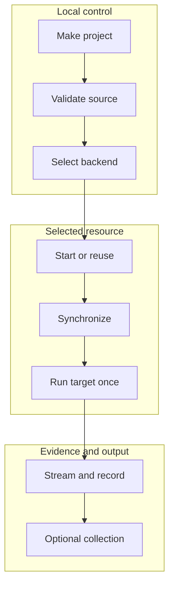

# Stateless remote Make

Day 1 of the [Remote workstation tutorials](../README.md). This tutorial can be
read independently.

## Why remote Make exists

Modern development often needs hardware that is absent from a laptop: a CUDA
GPU, a larger memory system, a Linux-only toolchain, or simply more CPU. Cloud
services make that hardware available, but each service presents a different
notebook, command client, upload mechanism, login flow, and machine lifecycle.

That fragmentation changes a familiar development loop into provider-specific
operations:

```text
edit locally
  -> package or upload source
  -> find or start remote compute
  -> reconstruct the command
  -> retrieve useful output
```

Cloudmake keeps one ordinary automation boundary across those environments:
the project Makefile. The developer chooses a backend; Cloudmake reaches it,
synchronizes the selected source, and invokes the exact project target.

The project-facing principle is **intrusion-free (non-intrusive) adoption**:
Cloudmake adapts the execution environment to an existing Make project instead
of requiring provider notebooks, repository credentials, reserved Make targets,
or a required Cloudmake-specific directory layout.

In short, stateless Cloudmake answers: **how can a locally executable Make
project run on remote hardware without adopting a provider-specific workflow?**

“Stateless” does not mean Cloudmake forgets every preference or refuses to
reuse a live session. It means there is no promise that generated remote state
survives replacement of that session. Source and Make must be sufficient to
start again.

The normative project interface is in the
[Project contract](../reference/project-contract.md). Backend implementers should use the
separate [Backend contract](../reference/backend-contract.md).

## One command, unlike platforms

A backend is Cloudmake's adapter for one platform through one concrete access
path. The name identifies both, so two access paths to the same provider are
different backends.

The qualified paths already disagree on nearly every operational detail:

| Backend and platform | Who controls the resource | Command and transfer path | What can be reused | Distinct failure boundary |
| --- | --- | --- | --- | --- |
| `local` — this computer | The developer | Direct Make; no transfer | The local filesystem | Local tools and hardware |
| `colab-notebook` — Google Colab | The provider | Notebook upload, execution, and download APIs | Only the current live runtime | Capacity, authorization, and runtime replacement |
| `codespaces-ssh` — GitHub Codespaces | The provider | Provider lifecycle, SSH, and rsync | A named stoppable Codespace | Quota, wake-up, and SSH reachability |
| `host-ssh` — a lab or cloud host | The host operator | User-managed SSH and rsync | Whatever that host preserves | Provisioning, access, and host policy |

This heterogeneity is the problem Cloudmake absorbs. Without a backend adapter,
each row requires a different allocation command, readiness test, transfer
method, execution wrapper, failure interpretation, and cleanup procedure. With
Cloudmake, those differences remain honest backend capabilities while the
project-facing command remains `cloudmake TARGET`.

`cloudmake --backends` remains the authoritative complete inventory when an
operator needs status or richer capabilities introduced after Day 1.

## The one-minute model

Remember six rules:

1. The local selected tree is the source authority.
2. Every positional target belongs to the project Makefile.
3. Cloudmake may start or reuse one backend resource.
4. Source synchronization preserves paths but does not require Git on the VM.
5. The requested Make target is submitted at most once.
6. Generated remote state is useful while present but disposable.



The rest of this tutorial follows one invocation from project selection through
failure reporting and cleanup.

## A small vocabulary

| Term | Meaning here |
| --- | --- |
| **Project root** | Directory containing the authoritative Makefile and selected local source. |
| **Backend** | Adapter for one compute platform and its supported access path. |
| **Resource** | VM, notebook runtime, Codespace, or other compute allocated by the provider. |
| **Session reuse** | Later commands reach the same currently available resource. |
| **Source synchronization** | Reconciliation of selected local paths into the remote project tree. |
| **Target submission** | The point after which the remote Make target may have begun. |
| **Provenance** | Cloudmake's record of the selected context, preparation, submission, and observed result. |
| **Collection** | Retrieval of one project-chosen output directory after successful execution. |

## The project contract is deliberately small

An executable project needs a Makefile at its selected root:

```text
project-root/
|-- Makefile
`-- ...       # any project-defined layout
```

Cloudmake requires no `src/`, `build/`, or output directory. It reserves no
target names. These invocations name targets supplied by the project:

```sh
cloudmake compile
cloudmake benchmark SIZE=large
cloudmake firmware.bin BOARD=rev2
```

Trailing `NAME=value` arguments pass to Make without interpretation. Cloudmake
does not inject project variables or redefine what `build`, `test`, `run`, or
any other name means.

With the local backend, Cloudmake invokes the same root Makefile directly. That
is the reference behavior every remote backend must preserve.

## Selecting an execution context

A project can save its normal backend once:

```sh
cloudmake --use colab --gpu=T4
cloudmake compile
cloudmake benchmark SIZE=large
```

The saved backend, accelerator, session name, or SSH host is local Cloudmake
control state. It is not project source and does not prove that a remote
resource still exists. A later command observes the provider and reports
whether the resource was started or reused.

A compact execution banner makes that distinction visible:

```text
[cloudmake] backend=colab-notebook accelerator=T4 session=my-project resource=reused
```

The banner describes execution context, not a claim that the target itself
requires the selected accelerator.

Use `-b BACKEND` for an invocation-specific choice. Use `--status`, `--start`,
or `--stop` for Cloudmake operations; without the leading dashes, those words
remain ordinary project target names.

## Source synchronization without repository credentials

Cloudmake transfers the selected local tree. It does not require the remote VM
to clone a Git repository or receive the developer's GitHub credentials.

Three root paths are always outside source transfer:

- `.git/`, because repository metadata is not execution source;
- `.cloud-state/`, because Cloudmake control state must not upload itself; and
- `.cloudmake/`, because it contains Cloudmake-owned collected output.

Projects can exclude more paths in `.cloudmakeignore`. Before contacting a
provider, `cloudmake --sync-dry-run` shows the selected set.

On a reused resource, synchronization can be incremental. Unchanged source need
not move again, and files previously owned by source can be reconciled safely.
That optimization lasts only as long as the resource and its control evidence
remain valid. It is not cross-resource persistence.

## One target, one submission

Remote execution has an unavoidable uncertainty boundary. Before target
submission, Cloudmake can know that Make did not run. After submission, a lost
connection may hide whether Make started, completed, or changed remote state.

Cloudmake therefore records target state explicitly:

| State | Meaning | Automatic replay |
| --- | --- | --- |
| `not_submitted` | Failure occurred before Make could begin | Safe only when the specific infrastructure operation is classified retryable |
| `submitted` | Make returned a confirmed result | Never; report that result |
| `ambiguous` | Connection failed after submission could have occurred | Never |

At-most-once submission matters because Make targets are not guaranteed to be
pure. A target may upload a result, consume a license, modify a database, or
trigger another external action. Cloudmake does not assume replay is harmless.

When Cloudmake reports `target_submission=ambiguous`, do not immediately repeat
the target. Keep the resource available for inspection, read the provider output
and printed provenance path, and use `cloudmake --status` plus `--shell` or
`--open` when available. Check the project's own outputs, logs, databases, and
external side effects before deciding whether another invocation is safe.

Cloudmake treats every project target as potentially effectful by default. An
operator can assert idempotency for one invocation and separately request a
bounded replay policy:

```sh
cloudmake --idempotent --replay-for=30s benchmark SIZE=large
```

The contract keeps three ideas separate:

| Layer | Vocabulary | Who determines it |
| --- | --- | --- |
| Target semantics | Unknown/effectful or explicitly idempotent | The operator for this invocation |
| Delivery policy | At-most-once or bounded retry | Cloudmake, under explicit user policy |
| Observation | `not_submitted`, `submitted`, or `ambiguous` | The backend transport |

`--replay-for` requires `--idempotent`; the assertion is never read from a
project file or reused later. A normal nonzero Make result is never replayed.
The backend must also prove that attempts cannot overlap. No current backend has
enough evidence at every ambiguous boundary, so every backend rejects
`--replay-for` before contacting its provider. `replay_safe` remains a derived
Cloudmake decision, not a project property. Provenance records the assertion,
delivery policy, and ordered attempt evidence.

Temporary capacity retry is narrower. With `--retry-for`, a backend may retry a
positively classified allocation-capacity failure before source synchronization
or target submission. Once allocation succeeds, the requested target still runs
at most once.

## Expected and unexpected failures

Cloudmake separates three failure classes:

### Project failure

Make ran and returned nonzero. Its complete output remains visible, followed by
a concise summary:

```text
[cloudmake] target 'benchmark' failed with exit status 2
```

The local command returns nonzero and retains provider output plus provenance.
An internal notebook traceback is not useful for this expected result.

### Infrastructure failure

Cloudmake could not allocate, reach, synchronize, prepare, or collect from the
resource. The diagnostic identifies that stage and records whether the target
was submitted. Authentication, configuration, source, and artifact failures are
not disguised as Make errors.

### Unexpected Cloudmake failure

An unclassified internal exception remains diagnosable. Suppressing expected
target-failure noise must not hide a Cloudmake defect.

## Credentials remain with their owners

Cloudmake invokes official provider clients and the local SSH client. Those
clients retain their own login credentials, tokens, private keys, and host-trust
state. Cloudmake does not copy them into project source, generated notebooks,
remote Make environments, or provenance.

The source tree itself can still contain secrets. `.cloudmakeignore` and the
source preflight are therefore part of the trust boundary. “Cloudmake does not
manage credentials” is not the same as “every selected project file is safe to
upload.”

## Output and artifacts are separate

Make output is streamed for diagnosis. Project files remain remote unless the
project explicitly asks Cloudmake to collect a directory:

```sh
cloudmake --collect dist package-release VERSION=2.0
```

Here `package-release` is a project target and `dist` is a project-relative
directory chosen by that project. After confirmed success, Cloudmake retrieves
it into the local `.cloudmake/artifacts/` destination. Collection does not
impose a common output layout on every Make project. Cloudmake never moves,
deletes, overwrites, symlinks, or dual-writes root `artifacts/`.

Before adopting this contract, follow the
[artifact collection migration preflight](../guides/artifact-collection-migration.md).

## What stateless execution can reuse

During one resource lifetime, stateless execution can reuse:

- the backend selection can remain saved locally;
- a named live session can be reused;
- source transfer can be incremental;
- a session preparation receipt can avoid repeating idempotent setup.

All of these are warm-resource optimizations. If the provider replaces or
deletes the resource, Cloudmake may start cleanly. Cross-resource workspace
recovery begins with Day 2, not Day 1.

## Backend differences remain visible

Cloudmake normalizes the Make workflow, not the provider product:

- local execution has no transfer or cloud resource;
- SSH backends depend on an existing reachable host and its filesystem;
- Codespaces can stop and later wake a named provider resource;
- Colab can reuse one current notebook runtime but may replace it;
- notebook batch services may allocate a fresh job for every target; and
- provider capacity, network, quota, lifetime, and billing policy remain
  authoritative.

`cloudmake --backends`, `--doctor`, and `--status` expose the relevant
differences. Cloudmake fails early when a requested capability is not available;
it does not silently weaken the request.

## Daily workflow

For a small stateless project, the complete loop can remain compact:

```sh
# One-time project selection.
cloudmake --use colab --gpu=T4

# Targets supplied by this project's Makefile.
cloudmake bootstrap
cloudmake verify
cloudmake benchmark SIZE=small

# Optional explicit output retrieval.
cloudmake --collect results report

# Release the reusable resource when finished.
cloudmake --stop
```

The first target may pay allocation and setup cost. Later targets can reuse the
same session. If the session disappears, the next invocation starts from source
and Make again.

## The Day 1 boundary

### What stateless Cloudmake normalizes

- backend selection and prerequisite checks;
- source selection and synchronization;
- compact execution-context reporting;
- exact Make target and assignment forwarding;
- target-at-most-once submission;
- project versus infrastructure failure classification;
- provenance and provider-output retention; and
- explicit artifact collection.

### What Day 1 deliberately leaves open

- provider authentication ceremonies or credential storage;
- VM provisioning outside a backend's documented lifecycle;
- target names, project directory layout, or output layout;
- provider capacity, network, lifetime, quota, or price;
- automatic replay of an ambiguous target;
- recovery of mutable state after resource replacement, which Day 2 adds as an
  optional acceleration layer; or
- a portable application bundle and tool environment, which Day 3 adds through
  OCI, CDI, and the Dev Container contract.

These are the boundary of the stateless lesson, not a claim that later
Cloudmake releases cannot add orthogonal capabilities. Day 4 then explains the
security model shared by the resulting remote-workstation layers.

The intended outcome is simple: a local Make project can use remote hardware
without becoming a provider-specific project. When repeated reconstruction
becomes the dominant cost, continue to
[Day 2: workspace persistence and checkpointing](workspace-persistence-landscape.md).
