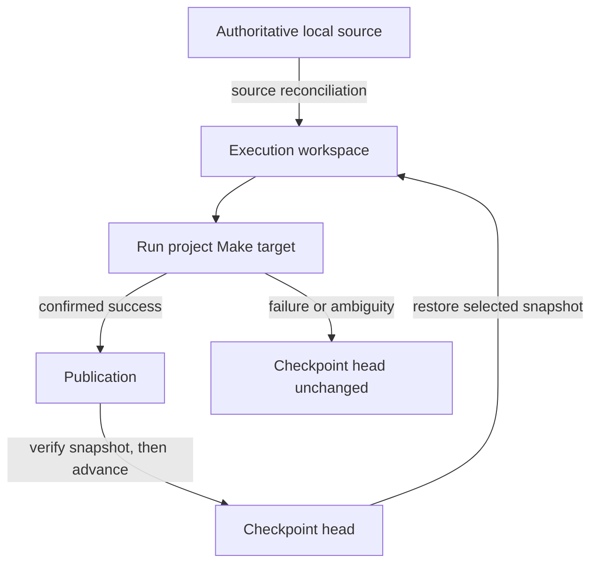

# Keeping work across disposable machines

Day 2 of the [Remote workstation tutorials](../README.md). This tutorial can be
read independently.

## The machine vanished; the work should not

Suppose an EDA flow completes synthesis and floorplanning, then spends hours on
placement and routing. The source may be small, while the generated design
database, netlists, timing data, and intermediate results occupy gigabytes. If
the VM disappears between stages, reproducing that state can cost most of a
working day. Reproducibility tells you that the work can be done again; it does
not give you the time back.

Cloud platforms make this harder because they give workspaces different
lifetimes:

| Qualified backend and platform | What can end | What happens to generated project state |
| --- | --- | --- |
| `local` — this computer | The local process | Files remain on the local disk |
| `host-ssh` — a lab or cloud host | The SSH connection or project process | Files normally remain on the host |
| `codespaces-ssh` — GitHub Codespaces | The running Codespace can stop | Its workspace remains available when the Codespace wakes |
| `colab-notebook` — Google Colab | The provider can replace the entire runtime | The old VM filesystem, including every generated build product, disappears |

The lopsided table is the point. The first three backends already give Make a
workspace that outlives an ordinary command or stop. They do not create the
problem this tutorial is trying to solve. Colab exposes the difficult case: a
valuable build workspace lives on a machine designed to disappear.

Day 2 focuses on that case alone. A **managed checkpoint** copies completed
project build state to durable storage outside the ephemeral VM and restores it
into a replacement VM. The goal is to avoid repeating hours of EDA work while
keeping the project rebuildable from source.

## Why nearby cloud storage matters

Persistent storage is storage whose lifetime is independent of the current
compute allocation. For a managed checkpoint it is a file or object service
outside the disposable VM. Compute and storage are often separate products
from the same cloud vendor even when they appear under one account.

That separation is valuable because the expensive data path can remain in the
cloud:

| Reconstruct from the laptop | Restore from nearby cloud storage |
| --- | --- |
| Gigabytes cross the laptop's Internet uplink | Workspace data moves between cloud services |
| Home or office bandwidth, latency, sleep, and disconnects dominate | The provider's internal infrastructure carries the bulk transfer |
| A full local snapshot may need uploading to every replacement | An incremental repository can reuse content already stored there |
| The laptop must remain available during the transfer | A replacement VM can restore after it is allocated |

“Nearby” does not mean free or unlimited. Authorization, service quotas,
retention rules, and charges remain provider-controlled. It means the laptop is
no longer the data plane for repeatedly moving a multi-gigabyte workspace.
Cloudmake still sends the selected project source from the laptop; the point is
that large build artifacts and intermediate results need not make that round
trip after every replacement.

Colab demonstrates the distinction clearly. The runtime and Google Drive are
different services with different lifetimes and authorization. Make runs on the
runtime's fast local disk. Cloudmake restores from Drive when a replacement VM
appears and publishes changed checkpoint content back to Drive after successful
work. The bulk data remains within Google's infrastructure, although a fresh
runtime may require the user to authorize Drive again.

## A small checkpoint taxonomy

Managed checkpointing has two places, two durable records, and three operations:

| Kind | Term | Meaning |
| --- | --- | --- |
| Place | **Execution workspace** | The fast, writable project tree on the current VM. Make reads and writes here. The whole tree may disappear with the VM. |
| Place | **Checkpoint repository** | The durable, incremental store outside the VM. It holds checkpoint data but is not the directory where Make runs. |
| Record | **Snapshot** | An immutable capture of the execution workspace after a confirmed successful target. |
| Record | **Checkpoint head** | The small reference naming the latest verified snapshot. It advances only after publication succeeds. |
| Operation | **Restore** | Reconstruct the execution workspace from the checkpoint head on a replacement VM. |
| Operation | **Source reconciliation** | Apply current authoritative local source after restore, so local edits win over an older snapshot. |
| Operation | **Publication** | Scan for changed content, upload and verify it, then advance the checkpoint head atomically. |

Here, a checkpoint means recoverable filesystem state. It is not a suspended VM
and does not capture a running process, memory, open connection, or application
transaction. The safe automatic boundary is a successfully completed Make
target.

## The one-minute model

Remember four rules:

1. Local source and the project Makefile remain authoritative.
2. Make runs in the execution workspace on the selected machine.
3. On a replacement machine, restore reconstructs the execution workspace from
   the checkpoint head; source reconciliation then applies current local source.
4. Only a confirmed successful target can begin publication, and the checkpoint
   head advances only after the new snapshot is verified.



A checkpoint accelerates reconstruction. It never replaces source, Make, or the
project's ability to rebuild from scratch.

## Should you turn persistence on?

Persistence is off by default. Enable it when recreating the execution
workspace costs materially more than restore and publication:

- a long build or simulation;
- a multi-stage EDA flow;
- an expensive generated database;
- large intermediate build artifacts; or
- results needed by later Make targets.

Leave it off for a small project that starts cheaply. Checkpointing has fixed
cost, and avoiding a few seconds of rebuilding is not worth another storage and
authorization path.

Select persistence for the current project and backend:

```sh
cloudmake --use colab --gpu=T4 --persist

# PROJECT_TARGET is supplied by this project's Makefile.
cloudmake PROJECT_TARGET
```

Later targets reuse that choice. To disable persistence and run the next
project target statelessly:

```sh
cloudmake --no-persist PROJECT_TARGET
```

The execution banner tells you that managed checkpointing is active and reports
its restore or publication outcome. The Make target and its variables do not
change.

## What managed checkpointing changes

Cloudmake maintains a checkpoint repository outside the disposable VM. On a
replacement resource, restore reconstructs the execution workspace from the
snapshot named by the checkpoint head. Source reconciliation then applies
current local source. After the target succeeds, publication creates and
verifies a new snapshot before advancing the checkpoint head.

If the same Colab runtime is still alive, Cloudmake continues from its execution
workspace. Publication can reuse content already in the checkpoint repository
and transfer only changes. That is an optimization within the
managed-checkpoint workflow, not a different persistence model the user must
select.

The checkpoint repository is not the execution workspace. Running Make
directly in a mounted repository would turn metadata latency and small writes
into a performance bottleneck. Restore and publication are boundary
operations; Make runs in the execution workspace on the VM's local disk.

## What happens during a managed run

For a replacement runtime, the sequence is:

```text
allocate compute
  -> authorize or attach the checkpoint repository
  -> restore the checkpoint head into the execution workspace
  -> perform source reconciliation
  -> run the requested Make target once
  -> confirmed success:
       publish and verify a new snapshot
       advance the checkpoint head
  -> failure or ambiguity:
       leave the checkpoint head unchanged
```

Restore precedes source reconciliation so current local edits win over the
older snapshot. Publication follows the target so an incomplete operation
cannot advance the checkpoint head.

On Colab, Drive authorization is a real user-visible limitation. Authorization
may be immediate in a reused runtime, but a new VM can require browser consent
again. Cloudmake keeps the large data movement cloud-to-cloud; it cannot turn an
ephemeral Drive credential into a permanent unattended identity.

## Incremental is cheaper, not free

Incremental publication reuses content already present in the checkpoint
repository, but it can still require:

- scanning metadata in the execution workspace;
- identifying changed content;
- taking a repository lock;
- uploading changed data;
- verifying the candidate snapshot; and
- atomically advancing the checkpoint head.

Restore likewise pays for access to the checkpoint repository, its metadata,
and the content the new VM needs. The comparison is checkpoint overhead versus
reconstruction—not checkpoint overhead versus zero.

This is why a multi-gigabyte build tree or routed design database may be an
excellent checkpoint candidate while a tiny generated file is not. It is also
why the location of the repository matters: incremental cloud-to-cloud transfer
can be practical when repeated laptop-to-cloud upload is not.

## Keep reusable work inside the execution workspace

Cloudmake can preserve only files inside the execution workspace. Useful
examples include:

- build directories;
- generated design databases;
- intermediate netlists, placement, routing, and timing results;
- simulation outputs; and
- long-running intermediate results.

Files outside the execution workspace and running process state disappear with
an ephemeral VM. Project recipes should therefore place reusable build products
inside the execution workspace.

Cloudmake does not assign checkpoint meaning to particular target names.
Project stages such as `synthesize`, `floorplan`, `place`, and `route` remain
ordinary Make targets. Their build products are retained because they are
inside the execution workspace when a target succeeds—not because of the
target's name.

The automatic checkpoint boundary is currently the successful completion of a
Make target. A flow split into project targets such as `synthesize`,
`floorplan`, `place`, and `route` can resume from its last completed stage. One
opaque target that runs for ten hours has no automatic mid-target recovery
point; adding such safe points requires an explicit project/Cloudmake protocol
rather than guessing when an application database is consistent.

## Failure behavior protects the last good state

A checkpoint repository keeps immutable snapshots and a checkpoint head naming
the latest verified one. During publication, Cloudmake uploads new content and
metadata, verifies the candidate snapshot, and advances the checkpoint head
last.

As a result:

- interrupted publication leaves the snapshot named by the checkpoint head
  usable;
- corrupt or incomplete content cannot advance the checkpoint head;
- concurrent writers cannot silently replace one another; and
- a failed or ambiguously completed Make target cannot publish uncertain
  execution-workspace state.

Cloudmake also does not replay an ambiguous target automatically. The first
execution may still be running or may already have produced external effects.
Day 1 explains how to inspect that state; the target-idempotency extension is
tracked separately for a future bounded replay policy.

## Credential and privacy boundary

The storage provider's official client or mount flow keeps its own login
credentials. Cloudmake does not place provider credentials in project source,
checkpoint metadata, Make variables, or provenance.

The Colab checkpoint repository is encrypted with a per-workspace key stored in
the local operating-system credential store. Cloudmake transports that key only
for the restore or publication operation, removes transient material, and
unmounts Drive before Make runs.

Encryption protects the checkpoint repository, but it does not decide which
project files are appropriate to preserve. Credentials or sensitive generated
data written inside the execution workspace remain the project's
responsibility.

## Finding and managing checkpoints

Managed checkpoint repositories have explicit recovery operations:

```sh
cloudmake --workspaces
cloudmake --workspace show [WORKSPACE_ID]
cloudmake --workspace attach WORKSPACE_ID
cloudmake --force --workspace purge WORKSPACE_ID
```

These commands apply only to Cloudmake-managed checkpoint repositories.

## What you can rely on

- Persistence remains explicit and off by default.
- Source reconciliation follows restore, so local source wins over the restored
  snapshot.
- Publication begins only after confirmed target success and advances the
  checkpoint head only after snapshot verification.
- Invalid, incompatible, interrupted, or concurrent publication cannot replace
  the snapshot named by the checkpoint head.
- Restore and publication outcomes appear in provenance.
- Losing every persistence optimization changes reconstruction cost, not the
  intended project result.

Cloudmake cannot guarantee provider retention, quota, price, runtime lifetime,
or unattended authorization. It does not preserve running processes,
machine-global changes, or application-specific in-process restart state. Those
limits remain visible rather than being hidden behind the common `--persist`
option.

The result is a practical compromise: disposable compute can feel like a
reusable workstation without making one remote filesystem irreplaceable. Day 3
continues the remote-workstation story from this recovered execution workspace.

The released operator contract is defined by this tutorial, the CLI help, and
[Resilience and recovery](../reference/resilience.md). Credential handling is
specified in the [Cloudmake security model](../reference/security.md).
Architecture rationale and qualification evidence are kept separately in the
maintainer design workspace.
