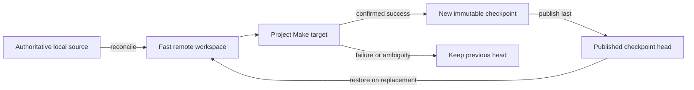

# Workspace persistence and checkpointing landscape

Day 2 of the [Remote workstation tutorials](tutorials.md). This tutorial can be
read independently.

## Why ephemeral compute wastes work

A project can be reproducible and still be expensive to rebuild. Source may be
small while downloaded dependencies, compiled tools, generated databases, and
intermediate results occupy gigabytes and represent hours of work. On an
ephemeral cloud machine, all of that mutable state disappears when the machine
is replaced.

The naive alternatives are both poor:

- rebuild everything after every replacement; or
- treat one remote filesystem as irreplaceable and hope it never disappears.

Workspace persistence offers a third choice. Source and Make remain the
authority, while previously generated state is retained only to avoid repeated
work. Losing that state may cost time, but it must not change what the project
means or make reconstruction impossible.

This is a different problem from application packaging. An OCI image or Dev
Container configuration describes the tool environment. Workspace persistence
preserves mutable state produced while using that environment. One does not
substitute for the other; see the separate
[Dev Container execution landscape](devcontainer-execution-landscape.md).

In short, persistence answers: **which useful mutable state can be reused after
the current compute resource stops or disappears?**

This document is a tutorial and implementation survey, not the Cloudmake
product contract. The normative behavior is in
[Stateful workspaces](stateful-workspaces.md), and the credential boundary is
in the [Cloudmake security model](security.md).

## The one-minute model

Remember six rules:

1. The selected source tree and Makefile remain authoritative.
2. Make runs in a fast writable workspace on the execution machine.
3. Reusing the same live session can preserve that workspace temporarily.
4. Native persistent storage can preserve it while compute is stopped.
5. A managed checkpoint can copy it to a separate durable store and restore it
   into a replacement machine.
6. Cloudmake advances a checkpoint only after a confirmed successful target.



The rest of this tutorial separates the persistence mechanisms, explains the
safe publication boundary, and shows which costs and risks each backend keeps.

## A small vocabulary

| Term | Meaning here |
| --- | --- |
| **Session reuse** | Later commands reach the same running compute session and its writable filesystem. |
| **Workspace** | The mutable project tree in which Make runs, including synchronized source and generated state. |
| **Native persistence** | The provider retains the workspace storage while compute stops; no checkpoint archive moves. |
| **Managed checkpoint** | Cloudmake snapshots a workspace into a separate store and can restore it into replacement compute. |
| **Snapshot** | One immutable, validated version of checkpointed workspace content. |
| **Head** | The small pointer naming the latest successfully published snapshot. |
| **Cache** | Reconstructible data retained to accelerate one operation, without the workspace recovery contract. |
| **Artifact** | Explicit project output selected for retrieval or publication, not automatic recovery state. |

These terms describe different guarantees. A reused session is not necessarily
durable. A durable disk is not a snapshot history. A cache is not a checkpoint,
and a checkpoint is not source control.

## Three persistence mechanisms

### Session reuse

Session reuse is the cheapest case. A later target reaches the same VM or
kernel, so the workspace, installed tools, and caches may still be present.
No restore is needed.

Its limit is equally simple: the state disappears when the provider replaces
the session. A Colab session name can find one current assignment; it does not
turn that pooled VM into a stopped, retained machine.

### Native persistence

Some providers separate compute lifetime from storage lifetime. A stopped
Codespace can retain `/workspaces`, and a stopped Compute Engine VM can retain
its attached Persistent Disk. Starting the same resource exposes the same
workspace without packaging or transferring it.

For Cloudmake, `--persist` is operationally a no-op on these backends. That is
still a meaningful result: the backend has satisfied the requested property
natively. Provider deletion, retention, corruption, and billing policies remain
authoritative.

### Managed checkpointing

An ephemeral backend needs storage outside the VM. Cloudmake snapshots the
managed workspace into that store and restores it into a later allocation.
Make still runs on the VM's fast local filesystem; the checkpoint store is not
the working directory.

This path requires more machinery: version identity, incremental transfer,
integrity checking, atomic publication, compatibility metadata, credential
separation, and conservative failure handling.

## Caches, images, checkpoints, and artifacts

All four can avoid work, but they have different jobs:

| Mechanism | Primary content | Normal authority |
| --- | --- | --- |
| OCI image | Immutable application and tool environment | Image reference and build input |
| Cache | Downloaded or computed data that can be regenerated | The operation that creates it |
| Workspace checkpoint | Mutable project state used to resume work | Source and Make, never the checkpoint |
| Collected artifact | Deliberately selected output | Project policy outside automatic recovery |

An OCI layer cache can avoid another image download without preserving build
outputs. A workspace checkpoint can preserve build outputs without preserving
the old kernel, driver, process, or container instance. Artifact collection can
save a final result without making the whole workspace resumable.

## Safe target lifecycle

For a newly allocated or reusable resource, Cloudmake follows one ordering:

```text
allocate or reuse compute
  -> restore the latest compatible checkpoint when needed
  -> reconcile authoritative source
  -> invoke the requested Make target once
  -> on confirmed success: snapshot, verify, then publish a new head
  -> on failure or ambiguity: retain the previous head
```

Restore happens before source reconciliation because current local source wins
over an older snapshot. Publication happens after Make because an automatic
checkpoint needs an unambiguous rule for becoming the next recovery point.

Cloudmake never retries a target merely because the connection disappeared
after submission. The target may have changed the workspace even when its
result cannot be observed. Replaying it could repeat an irreversible action;
publishing its uncertain state could replace the last known-good checkpoint.

## Why incremental does not mean free

An incremental checkpoint transfers only content the repository does not
already contain, but every cycle can still require:

- compute allocation and readiness;
- storage authorization or attachment;
- workspace scanning and metadata comparison;
- repository locking and integrity checks;
- changed-content upload; and
- final publication and cleanup.

The useful comparison is not “incremental versus zero cost.” It is “checkpoint
overhead versus the work that would otherwise be repeated.” A small project
should usually leave persistence disabled. A multi-gigabyte tool installation
or long build may justify the fixed overhead even when only a small fraction
changes.

Transfer location matters too. Moving gigabytes between a cloud VM and a
laptop is often the dominant cost. A provider-side store can keep restore and
publication cloud-to-cloud, though authorization, storage quotas, and provider
charges still apply.

## What belongs in the workspace

Cloudmake distinguishes four kinds of state:

| State | Owner | Persistence treatment |
| --- | --- | --- |
| Selected source | Developer | Reconciled after restore; current source wins |
| Generated workspace data | Project target | Included when inside the managed workspace |
| Cloudmake control data | Cloudmake | Stored separately as receipts, manifests, and provenance |
| Machine state outside the workspace | Provider or tool image | Not checkpointed |

This boundary is consequential for provisioning. An installation written only
to `/usr`, `/usr/local`, `/opt`, a system container store, a kernel module, or a
running service disappears with an ephemeral VM. Cloudmake cannot redirect an
arbitrary project installer without interpreting and changing that project.

If expensive tool state should survive VM replacement, its reusable
representation must live inside the managed workspace. It can be a relocatable
prefix, package cache, root filesystem archive, or another project-owned form.
A later target may perform inexpensive machine integration after restore.

Target names do not change this rule. `bootstrap`, `provision`, and `build` are
ordinary project targets; none receives special checkpoint semantics.

## Atomic publication and recovery

A checkpoint repository separates immutable snapshots from the mutable head.
New content and its manifest are written first. Integrity is checked next. The
head is updated last and only if it still names the expected previous version.

This ordering creates useful failure behavior:

- interruption during upload leaves the previous head valid;
- a failed integrity check cannot publish the candidate;
- concurrent writers cannot silently replace one another;
- unreferenced partial content can be cleaned later; and
- restore always begins from a fully published version.

Garbage collection is not part of the target-success path. Recovery correctness
comes before reclaiming storage.

## Compatibility is evidence, not project policy

A snapshot records enough environment information to detect a changed OS,
architecture, or accelerator runtime. Cloudmake reports incompatible or
suspicious state and rejects corrupt structure before replacing the active
workspace.

Cloudmake does not decide which generated files are semantically reusable on a
new processor or driver. That remains the project's Make dependency problem.
The restored workspace is acceleration state; the project's own rules decide
what must be rebuilt.

## Security boundary

Provider authentication stays with the provider's official client or mounted
storage surface. Cloudmake does not copy provider login credentials into source,
checkpoint metadata, project environments, or provenance.

The Colab checkpoint adapter encrypts workspace content with a Cloudmake-owned
per-workspace key stored in the local operating-system credential store. A
fresh short-lived envelope transports that key only to the restore or snapshot
helper. Provider storage is unmounted and the transient key material is removed
before Make runs.

Encryption protects stored checkpoint content; it does not make every file safe
to capture. Project-generated credentials inside the managed workspace remain
the project's responsibility. Source transfer retains its own secret and path
safety checks, while restored filesystem content is staged and validated before
it can replace the active workspace.

## Backend realization

| Backend class | Persistence result |
| --- | --- |
| Local | Native: the selected local tree already exists; no transfer occurs. |
| Host SSH | Native when the user-managed remote filesystem survives the intended lifecycle. |
| Codespaces | Native while the provider retains the stopped Codespace and `/workspaces` volume. |
| GCP Compute SSH | Native while the selected VM's Persistent Disk exists. |
| Colab notebook | Managed checkpoint through encrypted Google Drive storage; a replacement VM requires Drive authorization again. |
| Lightning Studio SSH | Native while the provider retains the Studio filesystem; product qualification is separate. |
| Kaggle notebook | Historical managed checkpoint retained for compatibility, not recommended as a remote workstation. |

The same `--persist` request therefore has different physical work. Cloudmake
reports the backend's mode instead of pretending every platform copies an
archive.

## User surface

Persistence is explicit and off by default:

```sh
# Select persistence for this project and backend.
cloudmake --use colab --gpu=T4 --persist

# Later targets reuse the selection.
cloudmake PROJECT_TARGET

# Return to the stateless behavior.
cloudmake --no-persist
```

`PROJECT_TARGET` stands for a target supplied by the project's Makefile.
Cloudmake reserves no target name for persistence.

Managed checkpoint workspaces also have option-only recovery operations:

```sh
cloudmake --workspaces
cloudmake --workspace show [WORKSPACE_ID]
cloudmake --workspace attach WORKSPACE_ID
cloudmake --force --workspace purge WORKSPACE_ID
```

Native provider workspaces remain provider-owned and are not listed as managed
checkpoint repositories.

## What Cloudmake normalizes

- one explicit project-level persistence request;
- backend reporting of native, checkpoint, or unsupported behavior;
- restore before source reconciliation;
- one target submission at most;
- publication only after confirmed success;
- immutable snapshot identity and atomic head advancement;
- compatibility, integrity, capacity, and path checks; and
- provenance for restore and publication outcomes.

## What Cloudmake does not normalize

- provider retention, quotas, prices, or VM lifetime;
- application-specific checkpoint or restart logic inside a running target;
- arbitrary machine state, installed kernel drivers, services, or processes;
- source control or archival backup;
- final artifact-retention policy;
- automatic replay after ambiguous execution; or
- reconstruction rules that belong in the project Makefile.

The intended result is modest but powerful: disposable compute can feel like a
reusable workstation, while every optimization remains safe to lose. Continue
to [Day 3: OCI/CDI and Dev Container execution](devcontainer-execution-landscape.md)
when the project also needs a portable tool environment.
